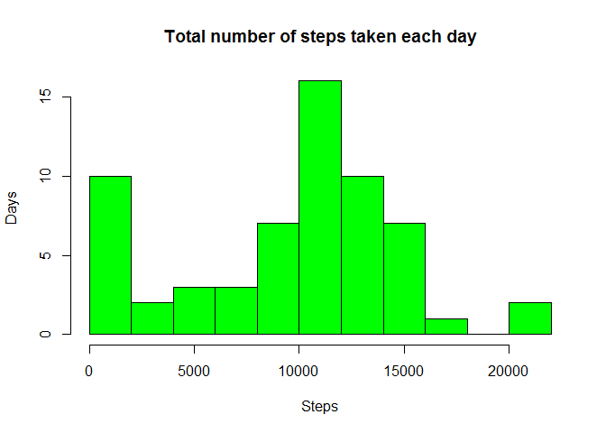
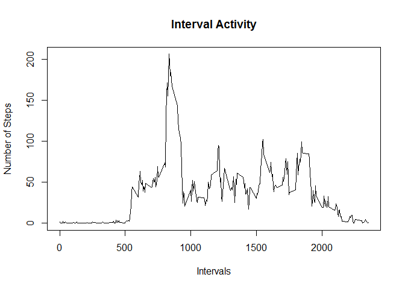
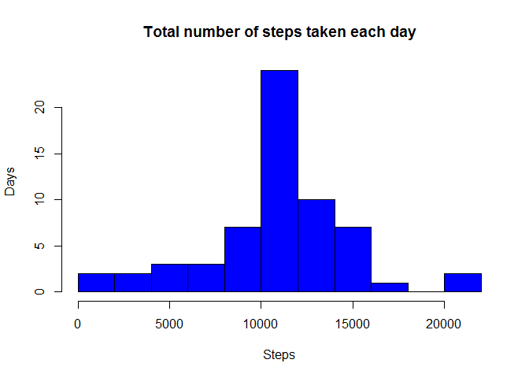
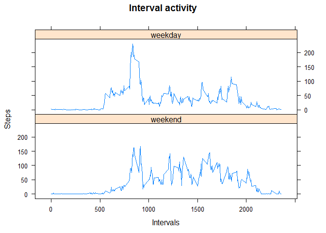

# Reproducible Research: Peer Assessment 1


```r
  # Used Libraries

  library(dplyr)
```

```
## Warning: package 'dplyr' was built under R version 3.2.5
```

```
## 
## Attaching package: 'dplyr'
```

```
## The following objects are masked from 'package:stats':
## 
##     filter, lag
```

```
## The following objects are masked from 'package:base':
## 
##     intersect, setdiff, setequal, union
```

```r
  library(lattice)
```

## Loading and preprocessing the data

```r
  activityData <- read.csv(unz("activity.zip", "activity.csv"))
```


## What is mean total number of steps taken per day?


```r
  # Group data by Date, calculate the total number of steps, its mean and median.
    
  dailyActivity <- group_by(activityData, date) %>%                                                          summarise(steps = sum(steps, na.rm = TRUE))
                            

  # Make histogram plot of total number of steps taken each day
  
  hist(dailyActivity$steps, breaks = 10, main = "Total number of steps taken each day",                             xlab = "Steps", ylab = "Days", col = "green")
```

<!-- -->

```r
  # Calculate the Mean and Median of total number of steps taken each day
  
  summarise(dailyActivity, MeanOfSteps = mean(steps, na.rm = TRUE),
                           MedianOfSteps = median(steps, na.rm = TRUE))                               
```

```
## # A tibble: 1 × 2
##   MeanOfSteps MedianOfSteps
##         <dbl>         <int>
## 1     9354.23         10395
```


## What is the average daily activity pattern?


```r
  # Group data by intervals and compute average number of steps in each interval acroos     all days
  
  intervalActivity <- group_by(activityData, interval) %>%
                      summarise(steps = mean(steps, na.rm = TRUE))
  
  # Make a time series plot
  
  plot(intervalActivity$interval, intervalActivity$steps, type = "l", 
        xlab = "Intervals", ylab = "Number of Steps", main = "Interval Activity")
```

<!-- -->

```r
  # Find an interval with the maximum number of steps
  interval = intervalActivity[which.max(intervalActivity$steps), 1]
  interval = interval[[1,1]]
```
An Interval with the max number of steps is 835.


## Imputing missing values
  

```r
  # Calculate and report the total number of missing values

  missingValues = sum(is.na(activityData$steps)) 
  
  
  
  # Fill in the missing values, based on the means of 5-min intervals
  
  imputedIntervalActivity <- group_by(activityData, interval) %>%
                                      mutate(steps = ifelse (is.na(steps), 
                                              mean(steps, na.rm =                                                                                       TRUE), steps))
                    
  imputedActivityData <- group_by(imputedIntervalActivity, date)
  
  # Group data by Date, calculate the total number of steps, its mean and median.
    
  imputedDailyActivity <- group_by(imputedIntervalActivity, date) %>%                                                          summarise(steps = sum(steps, na.rm = TRUE))
  
  
  
  # Make histogram plot of total number of steps taken each day
  
  hist(imputedDailyActivity$steps, breaks = 10, 
                                   main = "Total number of steps taken each day", 
                                   xlab = "Steps", ylab = "Days", col = "blue")
```

<!-- -->

```r
  # Calculate the Mean and Median of total number of steps taken each day
  
  summarise(imputedDailyActivity, MeanOfStepsImputed = mean(steps),
                           MedianOfStepsImputed = median(steps))
```

```
## # A tibble: 1 × 2
##   MeanOfStepsImputed MedianOfStepsImputed
##                <dbl>                <dbl>
## 1           10766.19             10766.19
```
A total number of missing values is 2304.


## Are there differences in activity patterns between weekdays and weekends?


```r
  #create a vector of weekens
  
  weekend <- c('Saturday', 'Sunday')
  
  
  #Use `%in%` and `weekends` to create a logical vector
  #convert to `factor` and specify the `levels/labels`
  imputedActivityData$day <- factor((weekdays(as.Date(imputedActivityData$date))                                  %in% weekend), 
                              levels=c(TRUE, FALSE), labels=c('weekend', 'weekday'))
  
  
  # Create panel Plot
  
  imputedActivityIntervalDay <- group_by(imputedActivityData, day, interval) %>%
                      summarise(steps = mean(steps))
  
  # Make a time series plot
  
  xyplot(steps ~ interval | day, data = imputedActivityIntervalDay, 
              layout = c(1,2), type = "l", xlab = "Intervals", ylab = "Steps", 
              main = "Interval activity")
```

<!-- -->
